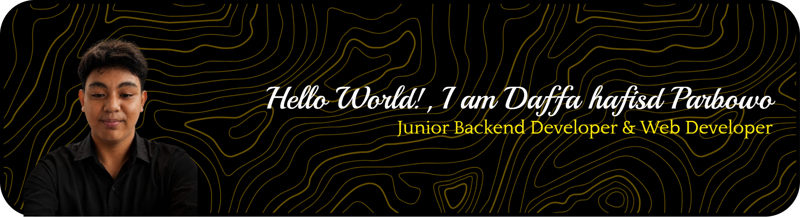

---

##### About Me
 **Hello World! 👋**

Saya **Daffa Hafisd P**, siswa kelas 12 **SMKN 1 Sayung** dari jurusan **PPLG (Pengembangan Perangkat Lunak dan Gim)**.

Saya adalah **Junior Backend Developer & Web Developer** yang memiliki ketertarikan dalam membangun aplikasi web, mengembangkan sistem backend, serta mengelola database. Saya senang mengubah ide menjadi sebuah sistem yang dapat digunakan dan terus belajar melalui berbagai project yang saya kerjakan.

Bagi saya, coding bukan cuma tentang menulis kode, tapi tentang **memecahkan masalah, membangun sesuatu, dan terus berkembang**. 🚀

Saat ini saya terus mengembangkan skill dan pengalaman untuk mempersiapkan diri masuk ke dunia industri teknologi.

**Keep learning. Keep building. Keep improving.**

---

##### Skills & Tools

---

##### Connect With Me

---

<picture>
  <source media="(prefers-color-scheme: dark)" srcset="https://raw.githubusercontent.com/daffahafisd11/daffahafisd11/pacman-output/pacman-contribution-graph-dark.svg">
  <source media="(prefers-color-scheme: light)" srcset="https://raw.githubusercontent.com/daffahafisd11/daffahafisd11/pacman-output/pacman-contribution-graph.svg">
  
</picture>
